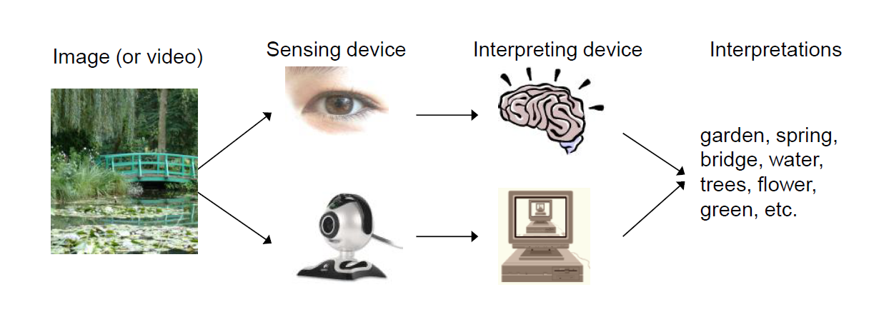

# Computer Vision Technology

机器视觉和计算机视觉的不同

机器视觉主要指用在机器的视觉系统上，而计算机视觉更广泛，包括应用在互联网、媒体等。

计算机视觉识别系统有哪些？

人脸识别，AI换脸，无人驾驶，已经非常常见了。

和哪些学科有关系？

认知科学和神经科学 研究人类的科学，计算机视觉的理论研究基础。

计算机科学，数学 包括算法 系统设计 数据结构 ；机器学习 都是计算机视觉的工具，完成CV任务

物理 需要采集数据，输入 ；图像处理 输入的是图像 输出的也是图像，解决图像本身的问题 如噪声清晰度等

CV系统 输入的是图像，输出的可能是图片的语义，结构信息等等

什么是智能？

CV是人工智能的一个领域

对比下棋和写诗

深蓝，阿尔法狗

国际象棋，围棋，机器战胜了人类，但始终无法写出有意义的诗句，没有意境，没有情感。

棋类的智能实际就是从大量的节点中搜索到最优解，但最优解并不是真正的智能。

我们人类的智能，和机器的智能是不一样的。机器的智能目前还只是数理的智能，加速数据处理。

3D Reconstruction 3D重构 实际上，人也可以重建很逼真的模型，CV系统能建立的很接近真实，

Recognizing chairs 对CV系统相对较难

What is CV?

The goal of CV

To bridge the gap between pixels and “meaning”M 

我们看到的是图片，计算机看到的矩阵。

人类视觉系统

1981 hubel wiesel 

生物大脑皮层的某个神经元往往会对一些简单的线条，集合图形产生兴奋。

计算机视觉系统

Origins of computer vision: an MIT summer project

1966年独立出来的学科

学科大牛 David Marr

Computational theory:
What is the goal of the computation (task) and what are the constraints that are known or can be brought to bear on the problem?

计算理论：到底要做什么事情，事情的约束是什么。

Representations and algorithms: 

How are the input, output, and intermediate information represented,
and which algorithms are used to calculate the desired result?

表达方式：输入输出，计算过程都应该如何表示。如输入时图像，输出是123数字。

Hardware implementation: 

How are the representations and algorithms mapped onto actual hardware, e.g., a biological vision system or a specialized piece of silicon? Conversely, how can hardware constraints be used to guide the choice of representation and algorithm?

硬件实现：如何将算法用到设备上，如何通过设备的约束指导算法的设计。

这三个层次相当于诸葛亮的隆中对。

有了框架就有了不同的人干不同的事情，有趣做理论建模的，算法表达的，应用实现的。其中第二层最难，包括从图像中提取边的信号，从边的信号组建出2D图形，从2D图形组建出3D图形。

ICCV颁发的马尔奖

What kind of information can we extract from an image?
Metric 3D information 三维信息
Semantic information 语义信息

3D信息更多的是用来测量，比如SLAM，同时建图和定位；还有三维模型重建

图像识别

计算机视觉就可以分为两大部分 三维重建和图像识别

