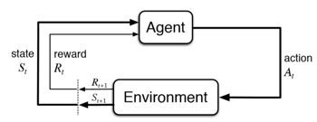
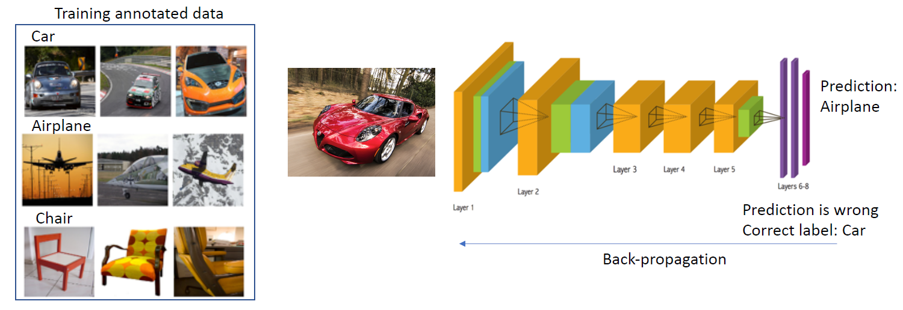
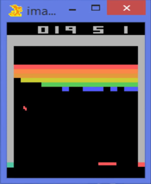
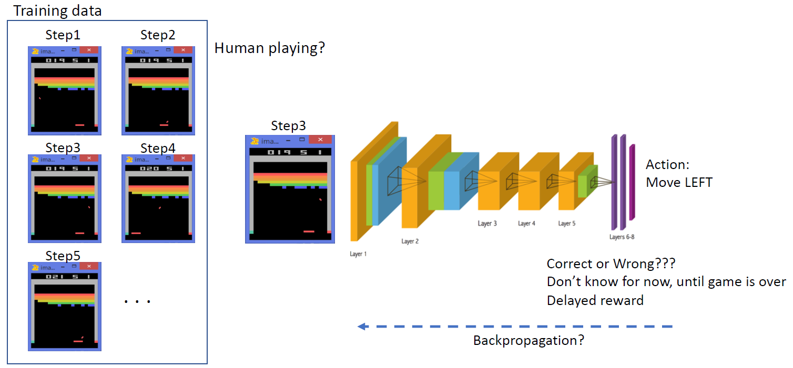
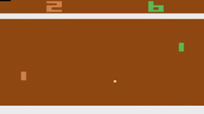
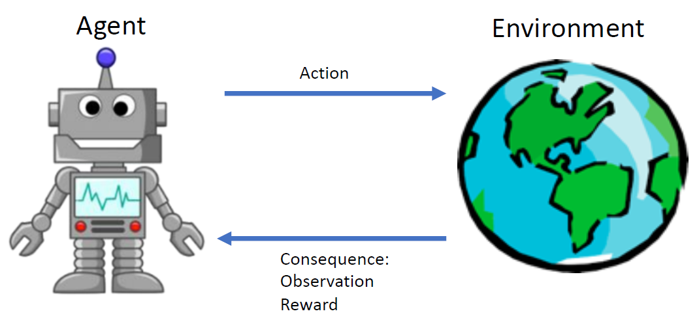

# Introduction

What is reinforcement learning and why we care?

A computational approach to learning whereby an **agent** tries to **maximize** the total amount of **reward** it receives while interacting with a complex and uncertain **environment**.

一个agent如何在一个复杂不确定的环境里面，去极大化它能获得的奖励，并且是一直在交互的。agent从环境中获取状态，然后输出一个action决策，放到环境中去，环境会按照决策进行下一步，然后输出下一个状态。agent的目的就是尽可能地从环境中获得奖励哦。

Supervised Learning: Image Classification

• Annotated images, data follows i.i.d distribution.

• Learners are told what the labels are.

对于监督学习，在图片分类的任务中，需要很多标定好的images（1号图片标定为车，2号图片标定为飞机……）并且data要服从iid分布（独立同分布）。然后设计一个分类器，当输入车的图片缺返回飞机，就告诉分类器这是错误的，然后把这个错误写成一个loss function，通过back-propagation训练分类器。要求数据尽可能的没有关联，不然不是很好进行学习；并且已经告知了输入的正确标签。

Reinforcement Learning: Playing Breakout

• Data are not i.i.d. Instead, a correlated time series data

• No instant feedback or label for correct action

强化学习：在打砖块的任务中，数据并不是独立的，上一帧的数据和下一帧的数据有非常强的连续性。另外，在任务进行中，agent并没有获得立刻的反馈，比如我现在把杆往右移，只能知道球会往左上反弹，但之后的情况就不得而知了。这也是强化学习的难点，没有得到很好的反馈，但依旧希望这个agent可以在这个环境中学习。RL的training data相当于玩游戏的过程，比如第一步往右移，第二部往左，training data就是一个序列。把序列输入到网络中，在当前的状态应该输出一个action如往右移，但是没有一个明确的label，说明这个action是正确还是错误的，需要等到游戏结束，才能知道结果。这就是面临了一个问题叫delayed reward，使得网络的训练十分困难。

Difference between Reinforcement Learning and Supervised Learning

• Sequential data as input (not i.i.d)

输入是不独立的有连续性的序列。

• The learner is not told which actions to take, but instead must discover which actions yield the most reward by trying them.

学习器并未被告知正确的行为是什么，学习器不得不自己去发现哪些行为对最终结果是有利的。

• Trial-and-error exploration (balance between exploration and exploitation)

agent在获得自身学习能力是通过不断的试错，exploration指不断尝试新的行为，新的行为可能获得更高的奖励，也可能一无所获；exploitation指已经知道这个行为可以获得一定的奖励，进行重复就可以了。两者需要权衡

• There is no supervisor, only a reward signal, which is also delayed

有一个奖励信号，环境会在一定延迟之后给出信号告诉这个行为是否有效，有益。

Features of Reinforcement Learning
• Trial-and-error exploration
• Delayed reward
• Time matters (sequential data, non i.i.d data)
• Agent’s actions affect the subsequent data it receives
(agent’s action changes the environment)

需要在环境里探索、试错来获取对环境的理解，agent会从环境获得延迟的reward，时间非常的重要，agent输出的action会影响随后它得到的数据，在训练agent的过程中采数据会根据agent和环境的交互而获得。如果agent在某个时刻crash了，那么整个学习就失败了，所以如何让agent可以一直稳定地学习也是强化学习的一个重点。

Big deal: Able to Achieve Superhuman Performance

为什么我们关注强化学习，非常重要的一点是它可以获得超人类的结果，监督学习的data是人为标定的，这个算法的上限就是人类的上限。对于强化学习，它自己在环境中探索，有非常大的潜力获得超越人类的能力，比如阿尔法狗。

Examples of reinforcement learning

• A chess player makes a move: the choice is informed
both by planning-anticipating possible replies and
counterreplies.
• A gazelle calf struggles to stand, 30 min later it runs 36
kilometers per hour.
• Portfolio management.
• Playing Atari game

下象棋，股票交易，玩游戏都是一个强化学习的过程，

RL example: Pong

Reinforcement Learning:
Sample actions (rollout), until game is over, then penalize each action

在强化学习中，通过让agent尝试完成游戏，再去说前面一系列action是正确还是错误的。

rollout指从当前帧生成很多局游戏，让当前的网络和环境进行交互，得到一堆观测，观测可以看成一个轨迹。也就是有一个当前帧，然后有一个决策，得到一个最终结果。通过最后的结果和观测到的序列来训练agent，使得agent获得能力，可以尽可能地得到最好的reward

Deep Reinforcement Learning:
Deep Learning + Reinforcement Learning

将强化学习和深度学习结合起来

Traditional CV and deep CV 

传统CV：通过两步完成。输入图片，提取它的特征；然后训练分类器，分类图片。

深度CV：有了卷积神经网络后，就将特征提取和分类结合到了一起，得到了一个端到端的训练。

Standard RL and deep RL

传统RL：需要手工设计一些特征，然后训练价值函数，然后做出决策。

深度RL：改进成端对端的神经网络，只需要输入状态，通过神经网络拟合整个过程得到最后的action。

Why RL works now?

• Computation power: many GPUs to do trial-and-error rollout
• Acquire the high degree of proficiency in domains governed by
simple, known rules
• End-to-end training, features and policy are jointly optimized toward
the end goal.

计算能力增加，可以从环境中获得大量信息，以至于取得很高的奖励，而且有了端到端的训练，可以让特征提取和决策网络一起优化。

## Introduction to Sequential Decision Making

## 时序决策过程

The agent learns to interact with the environment

强化学习研究的问题就是agent和环境的交互。agent在个环境不断地交互，agent把输出的动作给环境，环境进行下一步，将观测和得到的奖励返还给agent。agent的目的就要从这些观测中学到能获得极大化奖励的策略。

### Rewards

- A reward is a scalar feedback signal
- Indicate how well agent is doing at step t
- Reinforcement Learning is based on the maximization of rewards: All goals of the agent can be described by the maximization of expected cumulative reward.

RL定义了奖励函数，奖励是环境给的反馈信号，这个信号表明了agent在某一步采取了某个动作后是否得到了奖励，RL就是想要极大化这个奖励。

Examples of Rewards
• Chess players play to win:
+/- reward for wining or losing a game
• Manage stock investment
+/- reward for each profit or loss in $
• Play Atari games
+/- reward for increasing or decreasing scores

Sequential Decision Making

Objective of the agent: select a series of actions to maximize total future rewards

Actions may have long term consequences

Reward may be delayed

Trade-off between immediate reward and long-term reward

agent的目的就是得到一系列动作，使得最终结果的奖励最大化。某个动作可能会有长期的影响，奖励也是有延迟的。RL的一个重点就是近期奖励和长期奖励的权衡，如何获得更多的长期奖励。

• The history is the sequence of observations, actions, rewards.

agent在采取当前动作时，会依赖于之前的观测，动作和奖励，所以可以把整个任务的状态看成是历史的函数。

Environment state and agent state

agent内部也有一个函数更新状态，当环境和agent的状态

• **Full observability**: agent directly observes the environment state, formally as Markov decision process (MDP)

Partial observability: agent indirectly observes the environment, formally as partially observable Markov decision process (POMDP)

• Black jack (only see public cards), Atari game with pixel observation,

• What happens next depends on the history
• State is the function used to determine what happens next
